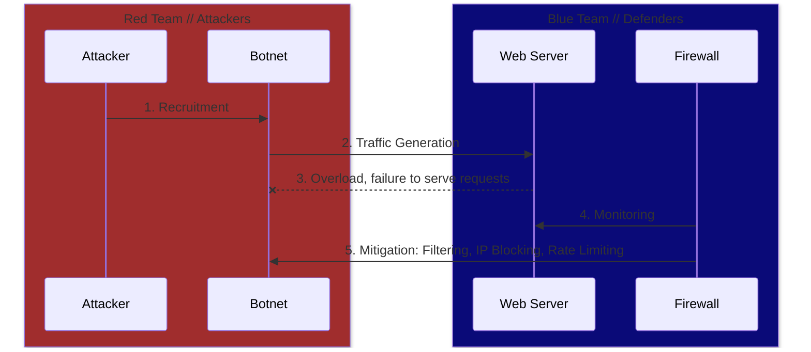

# Anatomy of a Basic DDoS 

A _**Distributed Denial of Service (DDoS)**_ attack is an attempt to flood a target server with an insurmountable volume of web traffic, overwhelming it and rendering it unable to serve real users' requests. 
This requires the ability to generate a large volume of inorganic web traffic. For this, a network of computers controlled by the attacker is used - we refer to this network as a _**Botnet**_. 
These computers are often rendered contrallable by malware. 

## What's the point of a DDoS?

DDoS attacks are malicious by nature. An attacker may stand to gain from a given server's downtime or impairment. The reasons for this could be endless - for example, the attacker could be an unscrupulous business competitor or maybe a geopolitical rival. 

### What's the typical order of events? 
Consider the diagram below. We have four main participants that we'll concern ourselves with, namely the _Attacker_, the _Botnet_, the _Web Server_ and the _Firewall_.

1. **Recruitment:** The _Attacker_ begins by recruiting a _Botnet_, typically via means such as malware or exploits of some kind. Participants in a Botnet are often unwilling and unknowing participants.
2. **Traffic Generation:** The _Botnet_ begins to spam the _Web Server_ with massive volumes of fictitious traffic, forcing it to attempt to serve requests.
3. **Overload:** The _Web Server_ attempts to serve the high volume of requests, overloading it and causing it to be effectively unusable by regular end users.
4. **Monitoring:** The _Firewall_ detects the unusual spike in web traffic, volume of requests, or some other commonality shared by requests from _Botnet_ computers.
5. **Mitigation:** The _Firewall_ attempts to mitigate the DDoS attack. It can do this in a number of ways, from rate limiting anyone requesting service, to IP blocking Botnet participants, to attempting to filter out malicious traffic.
